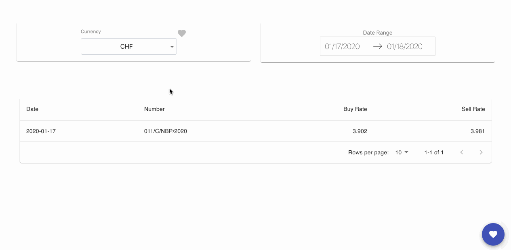

<h1 align="center">
  	 Currnecy Exchange Rate Tracker
</h1>

   
   

  <b>Get Updated currency rate</b> 
  <b>✨ React and redux app using <a href="http://api.nbp.pl/">Narodowy Bank Exchange API</a> ✨<b>
   
  
  
    

   <b>Currency Exchange Rate Tracker </b> is a react application using latest web technologies 
   <b>💥React, redux and material ui 💥</b>

## Installation

- Clone the repository `git clone https://github.com/joshuachinemezu/nbp-currency-exchanger.git`
- Run `yarn install` or `npm install`
- Rename the file `.env.example` to `.env` file using the cmd `mv .env.example .env`
- To start app `yarn start`
- For testing `yarn test`

## Build

- `yarn build`

## Technologies

- React
- Redux
- Axios
- Styled component
- Material UI
- Moment

## Contributions

- Spread the word
- Open pull requests

## License

MIT © [Joshua Chinemezu](https://github.com/joshuachinemezu)
